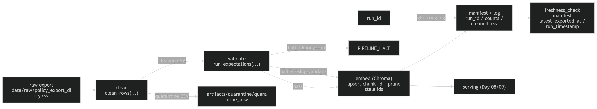

# Kiến trúc pipeline — Lab Day 10

**Nhóm:** C401 - F1
**Cập nhật:** 15/04/2026

---

## 1. Sơ đồ luồng (bắt buộc có 1 diagram: Mermaid / ASCII)

---

## 2. Ranh giới trách nhiệm

| Thành phần | Input                              | Output                                                                                     | Owner nhóm               |
| ---------- | ---------------------------------- | ------------------------------------------------------------------------------------------ | ------------------------ |
| Ingest     | `data/raw/policy_export_dirty.csv` | `rows`, `raw_records`, `run_id` trong log                                                  | Ingestion Owner          |
| Transform  | raw rows                           | `artifacts/cleaned/cleaned_<run_id>.csv` và `artifacts/quarantine/quarantine_<run_id>.csv` | Cleaning / Quality Owner |
| Quality    | cleaned rows                       | expectation results (`OK` / `FAIL`, `warn` / `halt`) và quyết định halt/tiếp tục           | Cleaning / Quality Owner |
| Embed      | cleaned CSV                        | Chroma collection `day10_kb`, `embed_upsert`, prune stale ids, metadata `run_id`           | Embed Owner              |
| Monitor    | manifest + log                     | `freshness_check`, manifest, giải thích PASS/WARN/FAIL trong docs                          | Monitoring / Docs Owner  |

---

## 3. Idempotency & rerun

Pipeline embed theo strategy **snapshot publish**. Ở bước embed, hệ thống lấy `chunk_id` từ cleaned CSV làm ID ổn định, sau đó **upsert** vào Chroma thay vì insert mới. Trước khi upsert, code còn đọc toàn bộ ID hiện có trong collection và xóa những ID không còn nằm trong cleaned run hiện tại (`prev_ids - set(ids)`), nên mục tiêu là tránh giữ lại vector cũ khi dữ liệu snapshot đã thay đổi.
=> **Upsert theo `chunk_id` + prune stale ids**.

`run_good-run-2.log` cho thấy run tốt đã embed `count=9` vào collection `day10_kb` và kết thúc `PIPELINE_OK`. Từ log này có thể khẳng định pipeline dùng `embed_upsert` chứ không append mù. Tuy nhiên, log hiện có không in trực tiếp kích thước collection trước/sau rerun, nên phần “không duplicate vector” được suy ra từ chính chiến lược `upsert chunk_id` trong code, không phải từ một dòng đếm collection riêng trong artifact.

---

## 4. Liên hệ Day 09

Day 09 tập trung vào agent AI orchestration, trong khi Day 10 chuyển trọng tâm sang data pipeline và observability ở data layer.

Pipeline này đóng vai trò cung cấp và làm mới corpus phục vụ retrieval cho `day09/lab`. Tùy theo thiết kế, dữ liệu có thể dùng chung từ `data/docs/` hoặc được export riêng để đảm bảo tính kiểm soát và tái lập.

---

## 5. Rủi ro đã biết

- `freshness_check` của run `good-run-2` đang **FAIL** vì `latest_exported_at="2026-04-10T08:00:00"` vượt SLA 24 giờ; điều này cho thấy dữ liệu snapshot có thể cũ dù pipeline run mới.
- Pipeline có chế độ `--skip-validate`, nên nếu dùng cùng với dữ liệu lỗi hoặc `--no-refund-fix`, hệ thống vẫn có thể embed dữ liệu xấu vào collection để phục vụ demo inject Sprint 3.
- `freshness_check.py` có hỗ trợ document-level SLA qua `doc_watermarks`, nhưng `manifest_good-run-2.json` hiện không có field này, nên monitoring hiện tại mới phản ánh **global freshness của batch**, chưa theo từng `doc_id`.
- `alert_channel` trong contract hiện vẫn là `__TODO__`, nên pipeline có log freshness nhưng chưa có bằng chứng về alert_channel đã được config.
